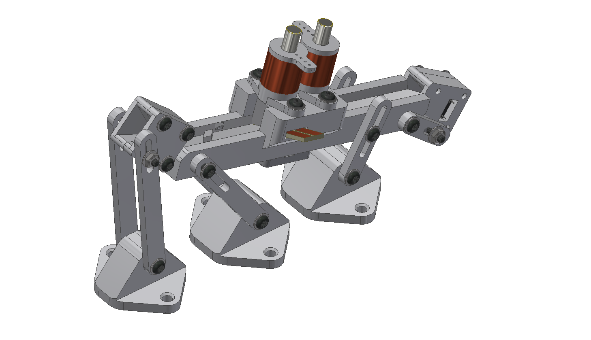

    

Measurement rail for SMD parts.

### Read more at BYTECHLAB:

<table style="width: 100%; border: none;" cellspacing="0" cellpadding="0" border="0">
  <tr>
    <td></td>
    <td>https://bytechlab.com/2018/08/measurement-rail-for-smd-parts/</td>
  </tr>
</table>

